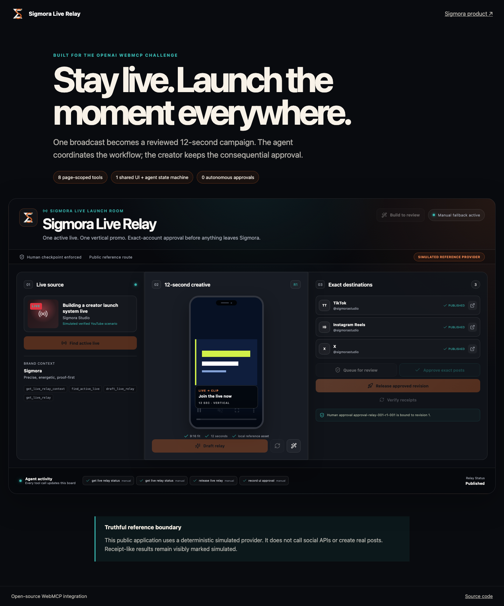

# Sigmora Live Relay — WebMCP

Sigmora Live Relay is a human-reviewed launch room where an agent and creator
operate the same visible release board. Eight page-scoped WebMCP tools take one
selected live event through drafting, generation progress, revision, exact
destination queueing, visible approval, idempotent release, and per-destination
status verification.

**Live reference:** <https://sigmora.org/en/webmcp-live-relay>

The hosted and local reference experiences use a deterministic simulated
provider. They do not call social-network APIs or create real posts. This is
visible in the UI and in every receipt-like result.



## Why WebMCP

A live creator cannot leave their broadcast to edit a vertical clip, rewrite
announcements for several destinations, choose exact accounts, review every
post, release it, and verify the results. WebMCP lets an agent coordinate that
multi-step workflow through narrow structured actions while the person retains
the consequential approval in the interface.

The agent does not scrape buttons or maintain a detached copy of page state.
Both the site tools and manual controls call the same `LiveRelayController`, so
the creator sees every change as it happens.

## The eight tools

1. `get_live_relay_context`
2. `find_active_live`
3. `draft_live_relay`
4. `get_live_relay`
5. `revise_live_relay`
6. `queue_live_relay`
7. `release_live_relay`
8. `get_live_relay_status`

Approval is deliberately not a ninth tool. The creator must review the exact
revision and queue-item set and approve it in the visible UI. Revision after
approval invalidates the approval; duplicate release requests are idempotent;
and destination results remain independent.

## Repository map

- `packages/live-relay-webmcp/` — framework-free contracts, schemas,
  controller, deterministic and HTTP providers, browser registration, and 30
  unit tests.
- `reference-app/` — standalone React/Vite reference UI using the exact shared
  board and package.
- `tests/` — browser coverage for tool discovery, the reviewed tool workflow,
  idempotency, visible state, and manual fallback.
- `NEW-FOR-WEBMCP.md` — competition-period change boundary and dated evidence.
- `SUBMISSION.md` — paste-ready description and judge walkthrough.
- `NOTICE.md` — license, trademark, hosted-service, and simulation boundary.

## Run locally

Requirements: Node.js 20 or newer and pnpm 10.27.0.

```bash
pnpm install --frozen-lockfile
pnpm typecheck
pnpm test
pnpm build
pnpm exec playwright install chromium
pnpm test:e2e
pnpm dev
```

Open <http://127.0.0.1:4173>. Without WebMCP the same workflow remains usable
through the ordinary buttons.

For Chrome testing, use Chrome 149 or newer, enable
`chrome://flags/#enable-webmcp-testing`, relaunch, and open the page as a
top-level document. In ChatGPT desktop, use the current built-in browser and
inspect **Site tools** in the address bar.

## Safety and verification

- All input object schemas are closed with `additionalProperties: false`.
- Tool results use typed success/failure envelopes with stable identifiers.
- Browser arguments never grant identity, membership, account ownership, or
  publishing authority.
- Queue items bind a relay revision to exact destination/account IDs.
- Approval binds the displayed revision and exact queue-item set.
- `release_live_relay` requires approval, its token, and an idempotency key.
- Page teardown aborts all eight registrations.
- The HTTP provider fails closed and never falls back to simulated state.

## License

The challenge integration code is MIT licensed. Sigmora's proprietary product,
service, infrastructure, publishers, generation engines, customer data,
credentials, name, logos, and trademarks are outside that grant. See
[`NOTICE.md`](NOTICE.md).
